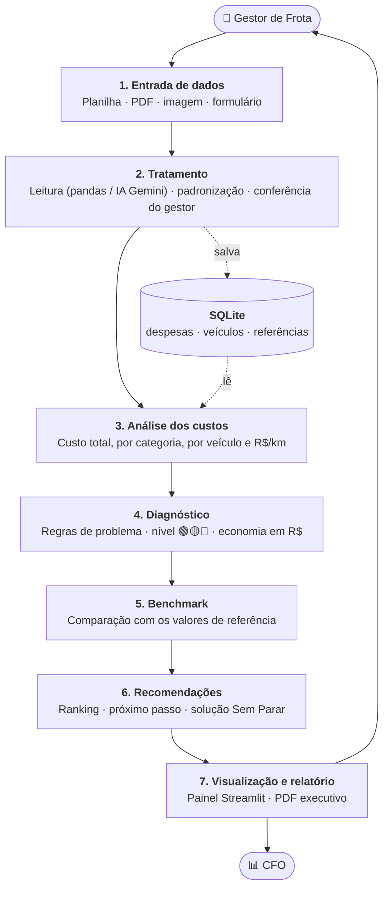

# FIAP - Faculdade de Informática e Administração Paulista

<p align="center">


</p>

<br>

# Raio-X da Frota: Calculadora de Redução de Custos de Frota

**Enterprise Challenge Sem Parar Empresas (Corpay) · Sprint 1: Planejamento**

## Grupo 12

## 👨‍🎓 Integrantes:
- [Almério Samuel Almeida Pinto](https://github.com/RM574304) (RM574304)
- [André Felipe Vieira da Silva](https://github.com/Andrefelipeam) (RM574808)
- [Helder de Melo Guerreiro](https://github.com/helderGuerreiro97) (RM575318)
- Priscila Fernandes de Carvalho (RM576037)

## 👩‍🏫 Professores:

### Tutor(a)
- Nome do Tutor

### Coordenador(a)
- [André Godoi Chiovato](https://www.linkedin.com/in/andregodoichiovato/)

---

## 🎬 Vídeo de apresentação

▶️ **[Assista no YouTube (não listado)](https://youtu.be/XYbYgzpZnPY)**

---

## 📑 Sumário

1. [O problema](#1-o-problema)
2. [A solução proposta](#2-a-solução-proposta)
3. [Usuários](#3-usuários)
4. [User Stories escolhidas](#4-user-stories-escolhidas)
5. [Dados](#5-dados)
6. [Entrada de dados](#6-entrada-de-dados)
7. [Dados incompletos e orientação ao usuário](#7-dados-incompletos-e-orientação-ao-usuário)
8. [Diagnóstico e economia](#8-diagnóstico-e-economia)
9. [Recomendações e plano de ação](#9-recomendações-e-plano-de-ação)
10. [Relatórios](#10-relatórios)
11. [Arquitetura](#11-arquitetura)
12. [Segurança e privacidade](#12-segurança-e-privacidade)
13. [Planejamento](#13-planejamento)

---

## 1. O problema

Uma empresa com frota gasta com **combustível, manutenção, pedágio, multas, impostos e seguro**. Cada despesa chega por um caminho diferente: planilha de abastecimento, PDF da oficina, foto de recibo, extrato da tag, notificação de multa.

Por isso o gestor **tem os dados, mas não tem a visão**. Ele não sabe com facilidade:

- quanto a frota custa por mês e por quilômetro;
- se esse custo é alto ou normal;
- onde está perdendo mais dinheiro e o que atacar primeiro;
- quanto economizaria corrigindo cada problema.

Juntar tudo à mão é demorado e quase nunca é feito. O CFO, por sua vez, não tem uma visão rápida e confiável para decidir.

---

## 2. A solução proposta

O **Raio-X da Frota** é uma calculadora web em que o gestor envia os dados da frota e recebe um diagnóstico com valores em reais.

```
Enviar dados  →  Organizar  →  Calcular custo total  →  Comparar com referência  →  Apontar problemas  →  Recomendar ações  →  Relatório
```

1. O gestor **envia** planilhas, PDFs ou fotos, do jeito que já tem.
2. A ferramenta **organiza** tudo num formato único. A IA lê PDFs e imagens, e o gestor confere antes do cálculo.
3. Calcula o **custo total** por mês, por categoria, por veículo e por km.
4. **Compara** cada indicador com valores de referência.
5. **Aponta as ineficiências**, classifica cada uma em 🟢 ok, 🟡 atenção ou 🔴 crítico, e mostra **quanto dá para economizar em R$**.
6. **Recomenda ações** por ordem de impacto financeiro e indica o **próximo passo**, ligado às soluções da Sem Parar quando fizer sentido.
7. Gera um **relatório executivo em PDF** para o CFO.

Se o gestor tiver poucos dados, a calculadora **dá uma estimativa mesmo assim** e diz o que falta enviar.

---

## 3. Usuários

| Perfil | O que precisa | O que a ferramenta entrega |
|---|---|---|
| 🚚 **Gestor de Frota** | Saber quanto gasta, onde está o desperdício e o que fazer | Painel com custo, problemas, economia e plano de ação |
| 📊 **CFO / Liderança** | Visão rápida para decidir | Relatório executivo de 1 página com custo total e economia potencial |
| 🏢 **Sem Parar Empresas** | Ajudar o cliente e mostrar suas soluções | Recomendações que indicam a solução Sem Parar ligada a cada problema |

---

## 4. User Stories escolhidas

Das 20 User Stories da Sem Parar Empresas, o grupo escolheu **14**. Elas usam praticamente a mesma base (um painel e um relatório), o que torna a entrega viável para o grupo. A numeração (US01 a US20) segue a ordem do documento da Sem Parar.

### ✅ Gestor de Frota (9 de 10)

| ID | User Story | Como vamos atender |
|---|---|---|
| US01 | Inserir dados em diferentes formatos | Upload de planilha (CSV/Excel), PDF e imagem. Planilhas são lidas direto; PDFs e imagens são lidos por IA. O gestor confere antes de salvar |
| US02 | Ver o custo total consolidado | Painel com custo total mensal e anual, por categoria, por veículo e R$/km |
| US03 | Identificar as principais ineficiências | Regras comparam cada indicador com a referência e marcam 🟢🟡🔴 |
| US04 | Comparar com um benchmark | Cada indicador aparece ao lado do valor de referência, com a diferença em % |
| US05 | Receber recomendações por nível de ineficiência | Tabela de ações prontas para cada problema e nível (🟡 ou 🔴) |
| US06 | Ver a economia potencial em R$ | Cada problema tem uma fórmula simples de economia (ex.: litros a mais × preço) |
| US07 | Saber o próximo passo | Destaque para a ação nº 1 do ranking, com o que fazer |
| US09 | Sempre ter uma estimativa, mais precisa com mais dados | 3 níveis de completude, com faixa de margem ([seção 7](#7-dados-incompletos-e-orientação-ao-usuário)) |
| US10 | Ser orientado sobre quais dados fornecer | Checklist das categorias e indicação do próximo dado a enviar |

### ✅ CFO / Liderança (4 de 4)

| ID | User Story | Como vamos atender |
|---|---|---|
| US11 | Relatório executivo | PDF de 1 página: custo total, top 5 problemas, economia e próximo passo |
| US12 | Ver a economia potencial em R$ | Economia anual em destaque no topo do relatório e do painel |
| US13 | Visão consolidada sem análise manual | O mesmo painel, calculado automaticamente a partir dos dados enviados |
| US14 | Identificar as maiores oportunidades | Ranking dos problemas ordenado pela economia em R$ |

### ✅ Sem Parar Empresas (1 de 6)

| ID | User Story | Como vamos atender |
|---|---|---|
| US15 | Recomendações conectadas às soluções Sem Parar | Cada problema indica a solução relacionada (ex.: pedágio pago manualmente → Tag Sem Parar) |

### ⏸️ Fora do escopo (evolução futura)

| ID | User Story | Por que ficou de fora |
|---|---|---|
| US08 | Atualizar os dados periodicamente | Exige histórico mês a mês e comparação entre períodos |
| US16 | Identificar clientes como leads | Exige cadastro comercial e cálculo de pontuação de leads |
| US17 | Melhorar o benchmark com os diagnósticos | Exige muitos clientes reais e anonimização |
| US18 | Cliente perceber valor no primeiro uso | Parcialmente atendida pela estimativa rápida (US09), mas sem foco específico |
| US19 | Gestor retornar periodicamente | Depende da US08 e de notificações |
| US20 | Guardar contatos do cliente como leads | Exige consentimento LGPD e fluxo comercial |

Essas histórias podem entrar numa versão futura, depois que o núcleo estiver funcionando.

---

## 5. Dados

### 5.1 Categorias de custo

| Categoria | Dados principais | Indicador |
|---|---|---|
| ⛽ Combustível | litros, preço por litro, km rodados | km/l e preço médio pago |
| 🔧 Manutenção | valor, preventiva ou corretiva | % de corretiva e R$/km |
| 🛣️ Pedágio | valor, pago com tag ou manualmente | % pago com tag |
| 🚨 Multas | valor, veículo | multas por veículo por mês |
| 🧾 Impostos | IPVA e licenciamento | R$ por veículo por ano |
| 🛡️ Seguro | valor anual da apólice | R$ por veículo por ano |

### 5.2 Dataset simulado

Criamos dados **fictícios** de 2 empresas, de abril a setembro de 2026, gerados pelo script [`src/simulacao/gerar_dados.py`](src/simulacao/gerar_dados.py).

| Empresa (fictícia) | Frota | Dados | Para que serve |
|---|---|---|---|
| E01 · TransNorte Cargas | 3 caminhões + 5 carretas | **Completos** | Mostrar o diagnóstico completo |
| E02 · Rota Leve Distribuidora | 8 carros + 4 utilitários | **Parciais** (só combustível e IPVA) | Mostrar a estimativa com dados incompletos |

Na E01 colocamos **problemas de propósito** para testar se o diagnóstico encontra o que deveria:
- uma carreta (E01-V06) consumindo 18% mais que a referência;
- um posto cobrando 9% acima do preço de referência;
- manutenção corretiva em cerca de 75% do gasto de manutenção (referência: até 30%);
- um caminhão (E01-V02) com multas repetidas;
- duas carretas pagando pedágio sem tag.

**Arquivos em [`data/`](data/):**

| Arquivo | Conteúdo |
|---|---|
| `empresas.csv` | As 2 empresas |
| `veiculos.csv` | 20 veículos (tipo, combustível, ano, km por mês) |
| `despesas.csv` | 418 lançamentos de despesas, um por linha |
| `referencias.csv` | Valores de referência usados na comparação |

**Colunas de `despesas.csv`** (o formato padrão para onde todo arquivo enviado é convertido):

| Coluna | Significado | Exemplo |
|---|---|---|
| `id` | Número do lançamento | `26` |
| `data` | Data da despesa (AAAA-MM-DD) | `2026-04-15` |
| `empresa_id` | Empresa | `E01` |
| `veiculo_id` | Veículo | `E01-V06` |
| `categoria` | combustivel, manutencao, pedagio, multa, imposto ou seguro | `combustivel` |
| `detalhe` | Subtipo (diesel, corretiva, tag, manual…) | `diesel` |
| `fornecedor` | Posto, oficina, órgão etc. | `Posto Estrela (fictício)` |
| `valor_rs` | Valor pago em R$ | `17974.28` |
| `litros` | Litros abastecidos (só combustível) | `2702.9` |
| `preco_litro` | Preço pago por litro (só combustível) | `6.65` |
| `km` | km rodados no período (só combustível) | `5762` |
| `origem` | De onde veio o dado: planilha, pdf, imagem, extrato | `planilha` |

**Valores de referência** (premissas do grupo, a serem trocados por fontes públicas como ANP e Tabela FIPE na Sprint 2):

| Indicador | Carro | Utilitário | Caminhão | Carreta |
|---|---|---|---|---|
| Consumo (km/l) | 11,0 | 9,5 | 5,0 | 2,6 |
| Manutenção (R$/km) | 0,12 | 0,18 | 0,35 | 0,55 |

Preço de referência: gasolina R$ 6,30/l e diesel R$ 6,10/l. Corretiva até 30% da manutenção. Até 0,1 multa por veículo por mês. 100% do pedágio pago com tag.

---

## 6. Entrada de dados

| Formato | Como será lido |
|---|---|
| Planilha (CSV, Excel) | Leitura direta com `pandas`; o gestor indica qual coluna é qual, se o nome for diferente |
| PDF e imagem (foto, print) | A **IA (Gemini)** lê o arquivo e devolve os dados já no formato de `despesas.csv` |
| Formulário | Campos simples para quem não tem arquivo ("quantos veículos?", "quanto gastou de combustível?") |

Depois da leitura, todo dado passa por três etapas:

1. **Padronização:** datas no formato AAAA-MM-DD, valores em R$, categoria escolhida de uma lista fixa.
2. **Validação:** confere se os valores fazem sentido (ex.: preço do litro entre R$ 3 e R$ 12, valor positivo, lançamento repetido).
3. **Conferência do gestor:** os dados lidos aparecem numa tabela e o gestor corrige o que estiver errado. **Nada entra no cálculo sem essa confirmação.**

---

## 7. Dados incompletos e orientação ao usuário

A calculadora **sempre mostra uma estimativa** (US09). Quanto mais dados, menor a margem.

| Nível | O que o gestor informou | Como calculamos | Margem estimada |
|---|---|---|---|
| **Básico** | Só a quantidade de veículos, o tipo e os km por mês | Todas as despesas estimadas pelos valores de referência | ± 30% |
| **Parcial** | Algumas categorias com valores reais | Valores reais onde há dado; referência no resto | ± 15% |
| **Completo** | Todas as categorias | Só valores reais | ± 5% |

As margens são premissas iniciais e serão ajustadas nos testes.

**Orientação (US10):** a tela mostra um checklist (✅ informado / ⚠️ estimado) e indica **qual dado enviar primeiro**: a categoria que falta e que costuma pesar mais no custo.

Exemplo com a E02 (dados parciais):

> ✅ Combustível · ✅ Impostos · ⚠️ Manutenção · ⚠️ Seguro · ⚠️ Pedágio · ⚠️ Multas
>
> Custo estimado: **R$ 24 mil a R$ 33 mil por mês** (nível Parcial).
>
> 👉 **Próximo dado a enviar: manutenção.** Depois do combustível, costuma ser o maior gasto. Pode mandar as notas da oficina em PDF ou foto.

---

## 8. Diagnóstico e economia

### 8.1 Regras

| Problema | Quando é apontado | Economia estimada |
|---|---|---|
| Consumo alto | km/l menor que 95% da referência | litros gastos a mais × preço médio pago |
| Combustível caro | preço pago acima de 102% da referência | (preço pago − preço de referência) × litros |
| Muita manutenção corretiva | corretiva acima de 30% da manutenção | metade do gasto corretivo acima de 30%¹ |
| Multas repetidas | 2 ou mais multas no mesmo veículo no período | 70% do valor das multas¹ |
| Pedágio sem tag | pedágio pago manualmente | 5% do valor pago manualmente¹ |

¹ Percentuais são premissas do grupo e serão validados com a Sem Parar na Sprint Review.

### 8.2 Nível e prioridade

- **Nível:** 🟢 dentro da referência · 🟡 até 15% pior · 🔴 mais de 15% pior.
- **Prioridade:** os problemas são ordenados pela **economia em R$**, do maior para o menor.

### 8.3 Exemplo com o dataset simulado (E01 · TransNorte Cargas)

| # | Problema | Nível | Economia em 6 meses |
|---|---|---|---|
| 1 | Manutenção corretiva em 75% do gasto | 🔴 | R$ 62,4 mil |
| 2 | Diesel comprado acima da referência | 🔴 | R$ 56,3 mil |
| 3 | Carreta E01-V06 com consumo alto (2,1 km/l, referência 2,6) | 🔴 | R$ 36,0 mil |
| 4 | Pedágio sem tag em 2 carretas | 🟡 | R$ 1,1 mil |
| 5 | Multas repetidas no E01-V02 | 🟡 | R$ 0,4 mil |

**Custo em 6 meses:** R$ 1,51 milhão · **Economia potencial:** cerca de R$ 156 mil (10,3%) · **Por ano:** cerca de R$ 312 mil.

---

## 9. Recomendações e plano de ação

Cada problema gera um **cartão de ação** com o problema, os números, o que fazer e a solução Sem Parar relacionada (US05, US07, US15). O primeiro do ranking aparece como **próximo passo**.

| Problema | 🟡 Atenção | 🔴 Crítico | Solução Sem Parar relacionada |
|---|---|---|---|
| Consumo alto / combustível caro | Comparar postos e revisar calibragem | Controlar o abastecimento por veículo | **Multiabastece** |
| Pedágio sem tag | Colocar tag nos veículos restantes | Gestão centralizada de pedágio | **Tag Sem Parar** / **Vale-Pedágio** |
| Multas repetidas | Conversar com o motorista | Programa de condução segura | **Gestor de Multas** |
| Muita manutenção corretiva | Montar calendário de revisões | Plano de manutenção preventiva | **Gestão de Manutenção** |

**Exemplo de próximo passo (E01):**
> 👉 **Montar um plano de manutenção preventiva.** A manutenção corretiva representa 75% do gasto de manutenção, quando o ideal é até 30%. Economia estimada: cerca de R$ 10 mil por mês. Solução relacionada: Gestão de Manutenção.

> A ligação com o portfólio é uma sugestão. A conversa comercial fica com a Sem Parar.

---

## 10. Relatórios

| Saída | Para quem | Conteúdo |
|---|---|---|
| **Painel** (tela) | Gestor | Custo total, gráfico por categoria, tabela por veículo, problemas 🟢🟡🔴 e plano de ação |
| **Relatório executivo** (PDF, 1 página) | CFO | Custo total, R$/km, top 5 problemas com economia em R$ e próximo passo (US11, US12) |

Para acompanhar a evolução, o gestor pode enviar os dados de um novo período e gerar um novo relatório. O histórico automático (US08) fica para uma versão futura.

---

## 11. Arquitetura



Versão em imagem: [`docs/arquitetura.png`](docs/arquitetura.png).

### Módulos

O código será dividido em partes independentes, separando **dados**, **análise**, **regras de negócio** e **interface**:

| Pasta em `src/` | Função | Camada |
|---|---|---|
| `entrada/` | Ler planilha, PDF e imagem; padronizar e validar | Dados |
| `analise/` | Calcular custo total e indicadores | Análise |
| `diagnostico/` | Comparar com a referência, aplicar regras, calcular economia, montar recomendações | Regras de negócio |
| `app/` | Telas e geração do PDF | Interface |

### Tecnologias

| Para quê | Ferramenta | Por quê |
|---|---|---|
| Linguagem | Python | É a linguagem do curso |
| Interface | Streamlit | Cria telas web só com Python |
| Planilhas | pandas | Padrão para tratar tabelas |
| Leitura de PDF e imagem | API do Google Gemini | Lê documentos e fotos sem treinar modelo; tem camada gratuita |
| Banco de dados | SQLite | Um arquivo só, sem servidor |
| Relatório PDF | fpdf2 | Biblioteca simples e gratuita |
| Organização | GitHub + Trello | Código versionado e tarefas no Kanban |

**Onde entra a IA:** só na leitura de PDFs e imagens, que é onde ela traz ganho claro. Os cálculos em R$ são feitos por **regras fixas**, para que todo número possa ser explicado.

---

## 12. Segurança e privacidade

| Tema | Como será tratado |
|---|---|
| **Acesso** | Login com e-mail e senha (guardada com hash); cada empresa só vê os próprios dados |
| **Dados do cliente** | Cadastro mínimo: nome da empresa, segmento, UF e e-mail do usuário para login. Esses dados são usados **só para o diagnóstico**, não para contato comercial |
| **Integridade** | O gestor confere tudo antes do cálculo; cada lançamento guarda a origem (planilha, PDF, imagem) |
| **Chaves e senhas** | Chave da API do Gemini em arquivo `.env`, fora do GitHub |
| **IA externa** | No Challenge, só enviamos **dados simulados** para a API |
| **LGPD** | Coletamos só o necessário. Dados de motoristas que aparecem em multas (nome, CNH) não são guardados |

---

## 13. Planejamento

### Sprints

| Sprint | O que será feito | User Stories |
|---|---|---|
| **S1** (até 09/10) | Planejamento: este README, dataset simulado, arquitetura, Kanban e vídeo | todas as escolhidas |
| **S2** | Leitura de planilha, padronização, banco SQLite, cálculo do custo total e indicadores, comparação com referência | US01 (planilha), US02, US04, US13 |
| **S3** | Leitura de PDF e imagem com IA, regras de diagnóstico, economia em R$, recomendações, níveis de completude e checklist | US01, US03, US05, US06, US07, US09, US10, US14, US15 |
| **S4** | Telas finais no Streamlit, relatório PDF, login, testes e vídeo final | US11, US12 |

### Responsabilidades

Todos participam da documentação, das revisões e do vídeo. Cada um é **dono** de uma parte:

| Integrante | Parte principal |
|---|---|
| **Almério Samuel Almeida Pinto** | Arquitetura, banco de dados, segurança e integração das partes |
| **André Felipe Vieira da Silva** | Entrada de dados: leitura de planilha, PDF e imagem (IA), padronização |
| **Helder de Melo Guerreiro** | Diagnóstico: indicadores, referências, regras e cálculo de economia |
| **Priscila Fernandes de Carvalho** | Interface, relatório PDF, recomendações e organização do Kanban |

### Kanban

Quadro no Trello: **[Kanban Raio-X da Frota](https://trello.com/invite/b/6ac013664778c2d93cf67e11/ATTIb98e94dd8598c779c755ad4894fbd1fe954DC0A1/raio-x-da-frota)**. Os cartões estão listados em [`docs/kanban_trello.md`](docs/kanban_trello.md).

---

## 📁 Estrutura de pastas

* **`data/`**: dataset simulado (empresas, veículos, despesas e referências).
* **`docs/`**: diagrama da arquitetura, cartões do Kanban e roteiro do vídeo.
* **`notebooks/`**: reservado para análises das próximas Sprints.
* **`src/`**: nesta Sprint, só o script que gera o dataset simulado.
* **`README.md`**: este documento.

## 📎 Links e Observações

### 🔗 Links do Projeto

* **[Vídeo da Sprint 1](https://youtu.be/XYbYgzpZnPY)**: apresentação da proposta.
* **[Kanban no Trello](https://trello.com/invite/b/6ac013664778c2d93cf67e11/ATTIb98e94dd8598c779c755ad4894fbd1fe954DC0A1/raio-x-da-frota)**: tarefas do grupo.

### 🧠 Decisões Técnicas

> - **14 de 20 User Stories:** escolhemos as que usam a mesma base (painel + relatório). As que exigem histórico mensal ou estrutura comercial ficaram para uma versão futura.
> - **Regras em vez de modelos complexos:** o diagnóstico usa regras simples e explicáveis, mais adequadas a valores financeiros e ao prazo do grupo.
> - **IA só onde ajuda de verdade:** ler PDFs e imagens.
> - **Conferência do gestor antes do cálculo:** evita que um erro de leitura vire um diagnóstico errado.
> - **Python + Streamlit + SQLite:** ferramentas simples, que todo o grupo consegue usar.

### 📢 Observações Gerais

* **Participação na Competição:** [ ] Sim, aceitamos participar / [x] Não vamos participar.
* Todos os dados deste repositório são **simulados** e não representam empresas reais.

## 🔧 Como executar o código

Nesta Sprint não há aplicação (não é exigida). Para gerar de novo o dataset simulado:

```bash
pip install pandas numpy
python 1TIAO/ENTERPRISE-CHALLENGE/src/simulacao/gerar_dados.py
```

---

## 📋 Licença

[TEMPLATE - FIAP PORTFÓLIO AI](https://github.com/fiap-tutoria/FIAP-PORTFOLIO-AI) por [FIAP](https://fiap.com.br) está licenciado sobre [Attribution 4.0 International](http://creativecommons.org/licenses/by/4.0/?ref=chooser-v1).
